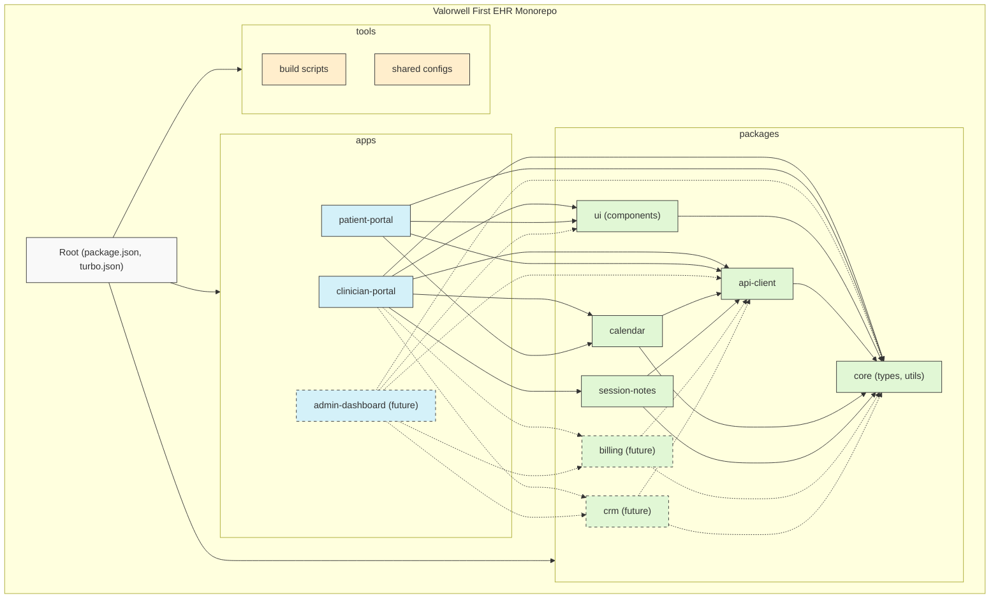
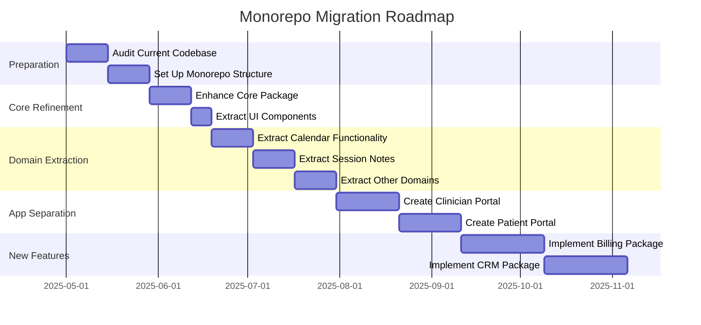
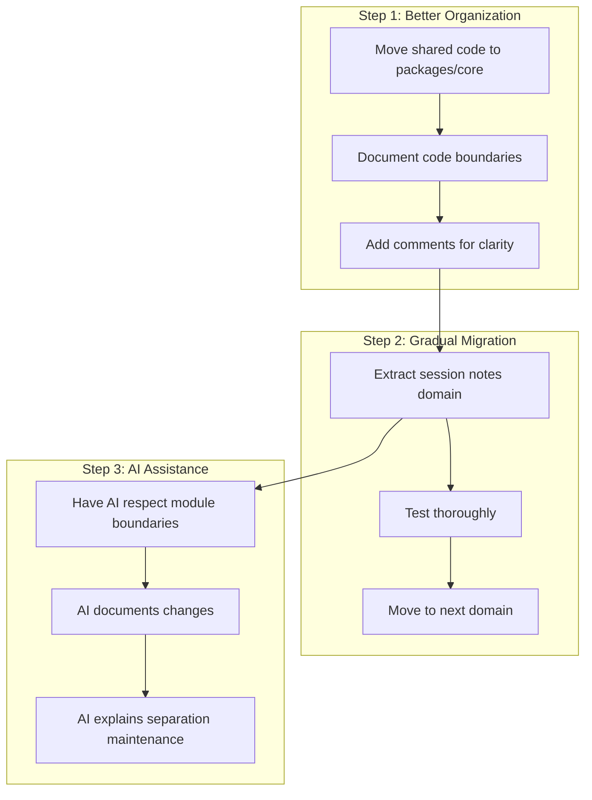
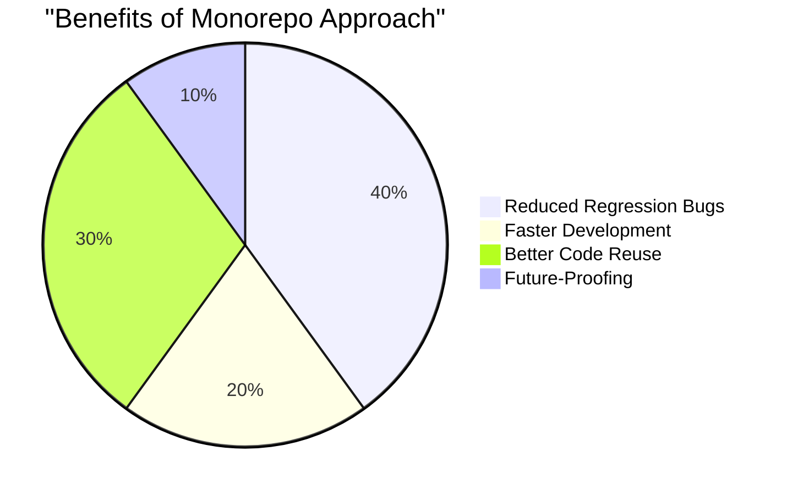

# Valorwell First EHR - Monorepo Structure Diagram

This diagram illustrates the proposed monorepo structure for the Valorwell First EHR project, showing the relationships between different packages and applications.

## Monorepo Structure



## Migration Phases Visualization



## Alternative Simplified Approach

For a non-developer working with AI assistance, this simplified approach might be more manageable:



## Benefits Visualization



## ROI Timeline

```mermaid
graph LR
    subgraph "ROI Timeline"
        short["Short-term (1-3 months): Negative ROI"]
        medium["Medium-term (3-6 months): Break-even"]
        long["Long-term (6+ months): Positive ROI"]
    end
    
    short --> medium --> long
    
    classDef negative fill:#ffcccc,stroke:#333
    classDef neutral fill:#ffffcc,stroke:#333
    classDef positive fill:#ccffcc,stroke:#333
    
    class short negative
    class medium neutral
    class long positive