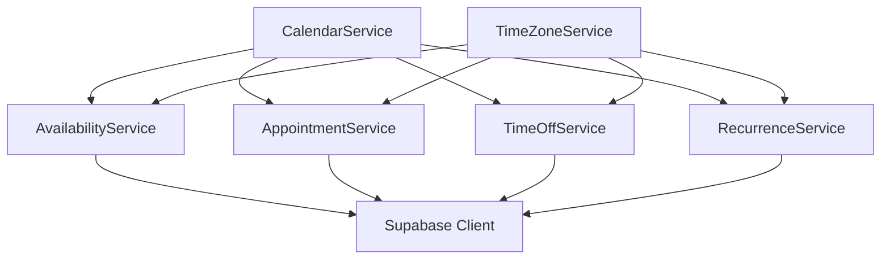

# Calendar and Scheduling System Architecture

This document outlines the architectural plan for rebuilding the calendar and scheduling system in our healthcare application.

## Table of Contents

1. [Overview](#overview)
2. [Database Schema](#database-schema)
3. [Frontend Component Architecture](#frontend-component-architecture)
4. [State Management](#state-management)
5. [API Service Layer](#api-service-layer)
6. [Authentication Integration](#authentication-integration)
7. [Permission System](#permission-system)
8. [Implementation Steps](#implementation-steps)

## Overview

The new calendar and scheduling system addresses several key requirements:

- Simplified database schema with clear separation of concerns
- Improved frontend component architecture to avoid deep nesting
- Centralized state management with proper synchronization
- Consistent time handling using Luxon
- Robust permission system
- Support for recurring events, appointments, and time off
## Database Schema

### Entity Relationship Diagram

```mermaid
erDiagram
    profiles {
        uuid id PK
        timestamp created_at
        timestamp updated_at
        text email
        text first_name
        text last_name
        text phone
        enum role
        text time_zone
    }
    
    clients {
        uuid id PK
        uuid profile_id FK
        timestamp created_at
        timestamp updated_at
        text status
        text time_zone
    }
    
    clinicians {
        uuid id PK
        uuid profile_id FK
        timestamp created_at
        timestamp updated_at
        text status
        text[] licensed_states
    }
    
    calendar_settings {
        uuid id PK
        uuid clinician_id FK
        timestamp created_at
        timestamp updated_at
        integer default_slot_duration
        integer max_advance_days
        integer min_notice_days
        text time_zone
        boolean is_active
    }
    
    availability_blocks {
        uuid id PK
        uuid clinician_id FK
        timestamp start_time
        timestamp end_time
        text availability_type
        uuid recurrence_pattern_id FK
        boolean is_active
        text time_zone
    }
    
    recurrence_patterns {
        uuid id PK
        text rrule
        timestamp created_at
        timestamp updated_at
    }
    
    availability_exceptions {
        uuid id PK
        uuid availability_block_id FK
        timestamp exception_date
        boolean is_cancelled
        uuid replacement_block_id FK
    }
    
    appointments {
        uuid id PK
        uuid client_id FK
        uuid clinician_id FK
        timestamp start_time
        timestamp end_time
        text type
        text status
        text notes
        uuid recurrence_group_id FK
        text time_zone
    }
    
    time_off {
        uuid id PK
        uuid clinician_id FK
        timestamp start_time
        timestamp end_time
        text reason
        boolean all_day
        text time_zone
    }
    
    profiles ||--o{ clients : "has"
    profiles ||--o{ clinicians : "has"
    clinicians ||--o{ calendar_settings : "has"
    clinicians ||--o{ availability_blocks : "has"
    clinicians ||--o{ appointments : "provides"
    clinicians ||--o{ time_off : "has"
### SQL Definitions

```sql
-- Keep existing profiles table
-- Keep existing clients table
-- Keep existing clinicians table

-- Replace availability_settings with calendar_settings
CREATE TABLE public.calendar_settings (
    id UUID NOT NULL DEFAULT gen_random_uuid(),
    clinician_id UUID NOT NULL REFERENCES clinicians(id) ON DELETE CASCADE,
    created_at TIMESTAMP WITH TIME ZONE NOT NULL DEFAULT now(),
    updated_at TIMESTAMP WITH TIME ZONE NOT NULL DEFAULT now(),
    default_slot_duration INTEGER NOT NULL DEFAULT 60,
    max_advance_days INTEGER NOT NULL DEFAULT 30,
    min_notice_days INTEGER NOT NULL DEFAULT 1,
    time_zone TEXT NOT NULL DEFAULT 'America/Chicago',
    is_active BOOLEAN DEFAULT true,
    PRIMARY KEY (id)
);

-- Create recurrence_patterns table
CREATE TABLE public.recurrence_patterns (
    id UUID NOT NULL DEFAULT gen_random_uuid(),
    rrule TEXT NOT NULL,
    created_at TIMESTAMP WITH TIME ZONE NOT NULL DEFAULT now(),
    updated_at TIMESTAMP WITH TIME ZONE NOT NULL DEFAULT now(),
    PRIMARY KEY (id)
);

-- Replace calendar_events with availability_blocks for availability only
CREATE TABLE public.availability_blocks (
    id UUID NOT NULL DEFAULT gen_random_uuid(),
    clinician_id UUID NOT NULL REFERENCES clinicians(id) ON DELETE CASCADE,
    start_time TIMESTAMP WITH TIME ZONE NOT NULL,
    end_time TIMESTAMP WITH TIME ZONE NOT NULL,
    availability_type TEXT NOT NULL CHECK (availability_type IN ('recurring', 'single')),
    recurrence_pattern_id UUID REFERENCES recurrence_patterns(id),
    created_at TIMESTAMP WITH TIME ZONE NOT NULL DEFAULT now(),
    updated_at TIMESTAMP WITH TIME ZONE NOT NULL DEFAULT now(),
    is_active BOOLEAN NOT NULL DEFAULT true,
    time_zone TEXT NOT NULL DEFAULT 'America/Chicago',
    PRIMARY KEY (id),
    CONSTRAINT valid_time_range CHECK (start_time < end_time),
    CONSTRAINT recurrence_required CHECK (
        CASE WHEN availability_type = 'recurring' 
             THEN recurrence_pattern_id IS NOT NULL
             ELSE true
        END
    )
);

-- Replace calendar_exceptions with availability_exceptions
CREATE TABLE public.availability_exceptions (
    id UUID NOT NULL DEFAULT gen_random_uuid(),
    availability_block_id UUID NOT NULL REFERENCES availability_blocks(id) ON DELETE CASCADE,
    exception_date TIMESTAMP WITH TIME ZONE NOT NULL,
    is_cancelled BOOLEAN DEFAULT false,
    replacement_block_id UUID REFERENCES availability_blocks(id) ON DELETE SET NULL,
    created_at TIMESTAMP WITH TIME ZONE NOT NULL DEFAULT now(),
    updated_at TIMESTAMP WITH TIME ZONE NOT NULL DEFAULT now(),
    PRIMARY KEY (id)
);

-- Update appointments table
CREATE TABLE public.appointments (
    id UUID NOT NULL DEFAULT gen_random_uuid(),
    client_id UUID NOT NULL REFERENCES clients(id),
    clinician_id UUID NOT NULL REFERENCES clinicians(id),
    start_time TIMESTAMP WITH TIME ZONE NOT NULL,
    end_time TIMESTAMP WITH TIME ZONE NOT NULL,
    type TEXT NOT NULL,
    status TEXT NOT NULL DEFAULT 'scheduled',
    notes TEXT,
    created_at TIMESTAMP WITH TIME ZONE NOT NULL DEFAULT now(),
    updated_at TIMESTAMP WITH TIME ZONE NOT NULL DEFAULT now(),
    recurrence_group_id UUID,
    time_zone TEXT NOT NULL DEFAULT 'America/Chicago',
    PRIMARY KEY (id),
    CONSTRAINT valid_appointment_time CHECK (start_time < end_time)
);

-- Update time_off table
CREATE TABLE public.time_off (
    id UUID NOT NULL DEFAULT gen_random_uuid(),
    clinician_id UUID NOT NULL REFERENCES clinicians(id) ON DELETE CASCADE,
    start_time TIMESTAMP WITH TIME ZONE NOT NULL,
    end_time TIMESTAMP WITH TIME ZONE NOT NULL,
    reason TEXT,
    all_day BOOLEAN DEFAULT false,
    created_at TIMESTAMP WITH TIME ZONE NOT NULL DEFAULT now(),
    updated_at TIMESTAMP WITH TIME ZONE NOT NULL DEFAULT now(),
    time_zone TEXT NOT NULL DEFAULT 'America/Chicago',
    PRIMARY KEY (id),
    CONSTRAINT valid_time_off_time CHECK (start_time < end_time)
);

-- Create unified calendar view
CREATE OR REPLACE VIEW public.unified_calendar_view AS
  -- Availability blocks
  SELECT
    id,
    clinician_id,
    'availability' as event_type,
    'Availability' as title,
    start_time,
    end_time,
    is_active,
    recurrence_pattern_id as recurrence_id,
    false as all_day,
    'availability_blocks' as source_table
  FROM 
    public.availability_blocks
  
  UNION ALL
  
  -- Appointments
  SELECT
    id,
    clinician_id,
    'appointment' as event_type,
    COALESCE(type, 'Appointment') as title,
    start_time,
    end_time,
    (status = 'scheduled') as is_active,
    recurrence_group_id as recurrence_id,
    false as all_day,
    'appointments' as source_table
  FROM 
    public.appointments
  
  UNION ALL
  
  -- Time off
  SELECT
    id,
    clinician_id,
    'time_off' as event_type,
    COALESCE(reason, 'Time Off') as title,
    start_time,
    end_time,
    true as is_active,
### Key Database Design Improvements

1. **Separation of Concerns**
   - Dedicated tables for each event type (availability, appointments, time off)
   - Clear relationships between entities

2. **Improved Data Integrity**
   - Proper foreign key constraints
   - Check constraints for data validation
   - Consistent timestamp handling with time zones

3. **Simplified UUID Handling**
   - Standard UUID generation with gen_random_uuid()
   - Proper foreign key relationships

4. **Optimized for Queries**
   - Unified view for calendar display
   - Indexes on frequently queried columns

## Frontend Component Architecture

### Component Hierarchy

```mermaid
graph TD
    A[CalendarPage] --> B[CalendarProvider]
    B --> C[CalendarHeader]
    B --> D[CalendarSidebar]
    B --> E[CalendarMainView]
    
    C --> C1[DateNavigator]
    C --> C2[ViewSelector]
    C --> C3[ClinicianSelector]
    
    D --> D1[FilterPanel]
    D --> D2[LegendPanel]
    
    E --> E1[FullCalendar]
    E --> E2[EventDialogs]
    
    E2 --> E2A[AppointmentDialog]
    E2 --> E2B[AvailabilityDialog]
    E2 --> E2C[TimeOffDialog]
    
    E1 --> E1A[DayView]
    E1 --> E1B[WeekView]
    E1 --> E1C[MonthView]
    
    F[CalendarService] --> F1[AvailabilityService]
    F --> F2[AppointmentService]
    F --> F3[TimeOffService]
    F --> F4[RecurrenceService]
```

### Key Component Descriptions

1. **CalendarPage**
   - Main container for the calendar functionality
   - Handles routing and high-level layout

2. **CalendarProvider**
   - Context provider for calendar state
   - Manages authentication integration

3. **CalendarHeader**
   - Contains navigation controls
   - Displays current view and date range
   - Provides clinician selection

4. **CalendarSidebar**
   - Displays filters and legend
   - Shows additional calendar information

5. **CalendarMainView**
   - Contains the FullCalendar component
   - Manages event dialogs and modals

6. **EventDialogs**
   - Specialized dialogs for each event type
   - Form validation and submission

### Component Implementation Example

```tsx
// src/components/calendar/CalendarPage.tsx
import React from 'react';
import { CalendarProvider } from '@/context/CalendarContext';
import { CalendarHeader } from './CalendarHeader';
## State Management

### Calendar Context

The calendar state is managed through a React Context that provides:

1. **View State**
   - Current view (day, week, month)
   - Selected date range
   - Selected clinician

2. **Data State**
   - Availability blocks
   - Appointments
   - Time off periods

3. **UI State**
   - Loading indicators
   - Error handling
   - Filter settings

### Context Implementation

```typescript
// src/context/CalendarContext.tsx
import React, { createContext, useContext, useState, useEffect, useCallback, useMemo } from 'react';
import { DateTime } from 'luxon';
import { useAuth } from '@/hooks/useAuth';
import { CalendarService } from '@/services/calendar/CalendarService';
import { CalendarEvent, CalendarViewType } from '@/types/calendar';

interface CalendarState {
  // View state
  view: CalendarViewType;
  currentDate: DateTime;
  selectedClinicianId: string | null;
  
  // Data state
  events: {
    availability: CalendarEvent[];
    appointments: CalendarEvent[];
    timeOff: CalendarEvent[];
  };
  
  // UI state
  isLoading: {
    availability: boolean;
    appointments: boolean;
    timeOff: boolean;
  };
  error: Error | null;
  
  // Filters
  showAvailability: boolean;
  showAppointments: boolean;
  showTimeOff: boolean;
}

interface CalendarContextValue extends CalendarState {
  // View actions
  setView: (view: CalendarViewType) => void;
  setCurrentDate: (date: DateTime) => void;
  setSelectedClinicianId: (id: string | null) => void;
  
  // Filter actions
  setShowAvailability: (show: boolean) => void;
  setShowAppointments: (show: boolean) => void;
  setShowTimeOff: (show: boolean) => void;
  
  // Data actions
  refreshEvents: () => Promise<void>;
  
  // Availability actions
  createAvailability: (event: CalendarEvent) => Promise<CalendarEvent | null>;
  updateAvailability: (event: CalendarEvent) => Promise<CalendarEvent | null>;
  deleteAvailability: (eventId: string) => Promise<boolean>;
  
  // Appointment actions
  createAppointment: (event: CalendarEvent) => Promise<CalendarEvent | null>;
  updateAppointment: (event: CalendarEvent) => Promise<CalendarEvent | null>;
  deleteAppointment: (eventId: string) => Promise<boolean>;
  
  // Time off actions
  createTimeOff: (event: CalendarEvent) => Promise<CalendarEvent | null>;
  updateTimeOff: (event: CalendarEvent) => Promise<CalendarEvent | null>;
  deleteTimeOff: (eventId: string) => Promise<boolean>;
}

const CalendarContext = createContext<CalendarContextValue | undefined>(undefined);

export const CalendarProvider: React.FC<{ children: React.ReactNode }> = ({ children }) => {
  // Authentication state
  const { user, isLoading: isAuthLoading } = useAuth();
  
  // Initialize state with proper types
  const [state, setState] = useState<CalendarState>({
    // View state
    view: 'timeGridWeek',
    currentDate: DateTime.now(),
    selectedClinicianId: null,
    
    // Data state
    events: {
      availability: [],
      appointments: [],
      timeOff: [],
    },
    
    // UI state
    isLoading: {
      availability: false,
      appointments: false,
      timeOff: false,
    },
    error: null,
    
    // Filters
    showAvailability: true,
    showAppointments: true,
    showTimeOff: true,
  });
  
  // Implement methods for state updates and data operations
  
  // Create context value
  const contextValue = useMemo(() => ({
    ...state,
    
    // View actions
    setView: (view: CalendarViewType) => {
      setState(prev => ({ ...prev, view }));
    },
    
    setCurrentDate: (date: DateTime) => {
      setState(prev => ({ ...prev, currentDate: date }));
    },
    
    setSelectedClinicianId: (id: string | null) => {
      setState(prev => ({ ...prev, selectedClinicianId: id }));
    },
    
    // Filter actions
    setShowAvailability: (show: boolean) => {
      setState(prev => ({ ...prev, showAvailability: show }));
    },
    
    setShowAppointments: (show: boolean) => {
      setState(prev => ({ ...prev, showAppointments: show }));
    },
    
    setShowTimeOff: (show: boolean) => {
      setState(prev => ({ ...prev, showTimeOff: show }));
    },
    
    // Data actions
    refreshEvents: async () => {
      // Implementation details
    },
    
    // Availability actions
    createAvailability: async (event) => {
      // Implementation details
      return null;
    },
    
    updateAvailability: async (event) => {
      // Implementation details
      return null;
    },
    
    deleteAvailability: async (eventId) => {
      // Implementation details
      return false;
    },
    
    // Appointment actions
    createAppointment: async (event) => {
      // Implementation details
      return null;
    },
    
    updateAppointment: async (event) => {
      // Implementation details
      return null;
    },
    
    deleteAppointment: async (eventId) => {
      // Implementation details
      return false;
    },
    
    // Time off actions
    createTimeOff: async (event) => {
      // Implementation details
      return null;
    },
    
    updateTimeOff: async (event) => {
      // Implementation details
      return null;
    },
    
    deleteTimeOff: async (eventId) => {
      // Implementation details
      return false;
    },
  }), [state, user]);
  
  return (
    <CalendarContext.Provider value={contextValue}>
      {children}
    </CalendarContext.Provider>
  );
};

export const useCalendar = () => {
  const context = useContext(CalendarContext);
  if (!context) {
    throw new Error('useCalendar must be used within a CalendarProvider');
  }
  return context;
};
```

### Key State Management Improvements

1. **Typed State**
   - Properly typed state with TypeScript
## API Service Layer

### Service Architecture



### Service Implementation

```typescript
// src/services/calendar/CalendarService.ts
import { AvailabilityService } from './AvailabilityService';
import { AppointmentService } from './AppointmentService';
import { TimeOffService } from './TimeOffService';
import { RecurrenceService } from './RecurrenceService';
import { CalendarEvent, EventType } from '@/types/calendar';

export class CalendarService {
  // Delegate to appropriate service based on event type
  static async getEvents(
    clinicianId: string,
    timeZone: string,
    startDate?: Date,
    endDate?: Date
  ): Promise<CalendarEvent[]> {
    const [availability, appointments, timeOff] = await Promise.all([
      AvailabilityService.getAvailability(clinicianId, timeZone, startDate, endDate),
      AppointmentService.getAppointments(clinicianId, timeZone, startDate, endDate),
      TimeOffService.getTimeOff(clinicianId, timeZone, startDate, endDate)
    ]);
    
    return [...availability, ...appointments, ...timeOff];
  }
  
  static async createEvent(event: CalendarEvent, timeZone: string): Promise<CalendarEvent | null> {
    switch (event.eventType) {
      case 'availability':
        return AvailabilityService.createAvailability(event, timeZone);
      case 'appointment':
        return AppointmentService.createAppointment(event, timeZone);
      case 'time_off':
        return TimeOffService.createTimeOff(event, timeZone);
      default:
        throw new Error(`Unknown event type: ${event.eventType}`);
    }
  }
  
  static async updateEvent(event: CalendarEvent, timeZone: string): Promise<CalendarEvent | null> {
    switch (event.eventType) {
      case 'availability':
        return AvailabilityService.updateAvailability(event, timeZone);
      case 'appointment':
        return AppointmentService.updateAppointment(event, timeZone);
      case 'time_off':
        return TimeOffService.updateTimeOff(event, timeZone);
      default:
        throw new Error(`Unknown event type: ${event.eventType}`);
    }
  }
  
  static async deleteEvent(eventId: string, eventType: EventType): Promise<boolean> {
    switch (eventType) {
      case 'availability':
        return AvailabilityService.deleteAvailability(eventId);
      case 'appointment':
        return AppointmentService.deleteAppointment(eventId);
      case 'time_off':
        return TimeOffService.deleteTimeOff(eventId);
      default:
        throw new Error(`Unknown event type: ${eventType}`);
    }
  }
}
```

### Specialized Service Example

```typescript
// src/services/calendar/AvailabilityService.ts
import { supabase } from '@/integrations/supabase/client';
import { CalendarEvent } from '@/types/calendar';
import { TimeZoneService } from '@/utils/TimeZoneService';

export class AvailabilityService {
  static async getAvailability(
    clinicianId: string,
    timeZone: string,
    startDate?: Date,
    endDate?: Date
  ): Promise<CalendarEvent[]> {
    try {
      // Validate inputs
      if (!clinicianId) {
        console.error('Missing clinician ID');
        return [];
      }
      
      const validTimeZone = TimeZoneService.ensureValidTimeZone(timeZone);
      
      // Build query
      let query = supabase
        .from('availability_blocks')
        .select(`
          id,
          clinician_id,
          start_time,
          end_time,
          availability_type,
          is_active,
          time_zone,
          recurrence_patterns(id, rrule)
        `)
        .eq('clinician_id', clinicianId)
        .eq('is_active', true);
      
      // Add date range filter if provided
      if (startDate && endDate) {
        query = query
          .gte('end_time', startDate.toISOString())
          .lte('start_time', endDate.toISOString());
      }
      
      // Execute query
      const { data, error } = await query;
      
      if (error) {
        console.error('Error fetching availability:', error);
        return [];
      }
      
      // Transform database results to CalendarEvent objects
      return data.map(block => ({
        id: block.id,
        title: 'Availability',
        start: TimeZoneService.convertToTimeZone(block.start_time, block.time_zone, validTimeZone),
        end: TimeZoneService.convertToTimeZone(block.end_time, block.time_zone, validTimeZone),
        eventType: 'availability',
        clinicianId: block.clinician_id,
        isRecurring: block.availability_type === 'recurring',
        recurrenceRule: block.recurrence_patterns?.rrule,
        isActive: block.is_active,
        sourceTimeZone: block.time_zone,
        displayTimeZone: validTimeZone
      }));
    } catch (error) {
## Authentication Integration

### Authentication Hook

```typescript
// src/hooks/useAuth.ts
import { useState, useEffect } from 'react';
import { supabase } from '@/integrations/supabase/client';
import { User } from '@supabase/supabase-js';

interface AuthState {
  user: User | null;
  isLoading: boolean;
  error: Error | null;
}

export function useAuth() {
  const [state, setState] = useState<AuthState>({
    user: null,
    isLoading: true,
    error: null
  });

  useEffect(() => {
    // Get initial session
    const getInitialSession = async () => {
      try {
        const { data, error } = await supabase.auth.getSession();
        
        if (error) {
          throw error;
        }
        
        setState({
          user: data.session?.user || null,
          isLoading: false,
          error: null
        });
      } catch (error) {
        setState({
          user: null,
          isLoading: false,
          error: error as Error
        });
      }
    };
    
    getInitialSession();
    
    // Subscribe to auth changes
    const { data: authListener } = supabase.auth.onAuthStateChange(
      async (event, session) => {
        setState(prev => ({
          ...prev,
          user: session?.user || null,
          isLoading: false
        }));
      }
    );
    
    return () => {
      authListener.subscription.unsubscribe();
    };
  }, []);
  
  return state;
}
```

### Integration with Calendar Context

```typescript
// src/context/CalendarContext.tsx (partial)
export const CalendarProvider: React.FC<{ children: React.ReactNode }> = ({ children }) => {
  // Authentication state
  const { user, isLoading: isAuthLoading } = useAuth();
  
  // Effect to load data when authentication is complete
  useEffect(() => {
    if (user && !isAuthLoading && state.selectedClinicianId) {
      // Load calendar data
      refreshEvents();
    }
  }, [user, isAuthLoading, state.selectedClinicianId]);
  
  // Rest of the implementation
};
```

### Key Authentication Improvements

1. **Clear Loading States**
   - Explicit isLoading flag for authentication
   - Prevents premature data loading

2. **Subscription-Based Updates**
   - Listens for auth state changes
   - Automatically updates UI when auth state changes

3. **Error Handling**
   - Captures and exposes authentication errors
   - Allows for user-friendly error messages

4. **Clean Integration**
   - Separates authentication concerns from calendar logic
   - Reusable authentication hook

## Permission System

### Permission Service

```typescript
// src/services/PermissionService.ts
import { supabase } from '@/integrations/supabase/client';

type PermissionLevel = 'none' | 'read' | 'write' | 'admin';
type ResourceType = 'availability' | 'appointment' | 'timeOff';

export class PermissionService {
  /**
   * Get the permission level for a user on a specific resource
   */
  static async getPermissionLevel(
    userId: string,
    resourceType: ResourceType,
    resourceOwnerId: string
  ): Promise<PermissionLevel> {
    try {
      // If user is the resource owner, they have full access
      if (userId === resourceOwnerId) {
        return 'admin';
      }
      
      // Check if user has admin role
      const { data, error } = await supabase
        .from('profiles')
        .select('role')
        .eq('id', userId)
        .single();
        
      if (error) {
        console.error('Error checking user role:', error);
        return 'none';
      }
      
      if (data?.role === 'admin') {
        return 'admin';
      }
      
      // Default permissions based on resource type
      switch (resourceType) {
        case 'availability':
          // Only owners and admins can manage availability
          return 'read';
        case 'appointment':
          // Clinicians can write to appointments they're involved in
          const isInvolved = await this.isUserInvolvedInAppointment(userId, resourceOwnerId);
          return isInvolved ? 'write' : 'read';
        case 'timeOff':
          // Only owners and admins can manage time off
          return 'read';
        default:
          return 'none';
      }
    } catch (error) {
      console.error('Error in getPermissionLevel:', error);
      return 'none';
    }
  }
  
  /**
   * Check if a user is involved in an appointment (as client or clinician)
   */
  private static async isUserInvolvedInAppointment(
    userId: string,
    appointmentId: string
  ): Promise<boolean> {
    try {
      const { data, error } = await supabase
        .from('appointments')
        .select('client_id, clinician_id')
        .eq('id', appointmentId)
        .single();
        
      if (error || !data) {
        return false;
      }
      
      return data.client_id === userId || data.clinician_id === userId;
    } catch (error) {
      console.error('Error checking appointment involvement:', error);
      return false;
    }
  }
  
  /**
   * Check if a user can perform an action on a resource
   */
  static async canPerformAction(
    userId: string,
    resourceType: ResourceType,
    resourceOwnerId: string,
    action: 'read' | 'create' | 'update' | 'delete'
  ): Promise<boolean> {
    const permissionLevel = await this.getPermissionLevel(userId, resourceType, resourceOwnerId);
    
    switch (action) {
## Implementation Steps

The implementation of the new calendar and scheduling system will be carried out in the following phases:

### 1. Database Migration

**Tasks:**
- Create new tables while keeping existing ones
- Implement triggers and constraints
- Create views for unified calendar display
- Add appropriate indexes for performance

**Key Considerations:**
- No need to migrate existing data as specified by the client
- Ensure proper UUID handling in all tables
- Implement proper time zone storage

### 2. Service Layer Implementation

**Tasks:**
- Create TimeZoneService for consistent time handling
- Implement specialized services for each event type
- Create CalendarService as a facade for all calendar operations
- Implement proper error handling and logging

**Key Considerations:**
- Use Luxon for all date/time operations
- Ensure consistent error handling across services
- Implement proper validation for all inputs

### 3. State Management Refactoring

**Tasks:**
- Implement new CalendarContext structure
- Create specialized hooks for different event types
- Ensure proper authentication integration
- Implement optimized state updates

**Key Considerations:**
- Properly type all state with TypeScript
- Ensure efficient rendering with useMemo and useCallback
- Handle loading and error states appropriately

### 4. UI Component Development

**Tasks:**
- Implement new component hierarchy
- Create specialized dialogs for each event type
- Integrate with FullCalendar
- Implement responsive design

**Key Considerations:**
- Follow component hierarchy as outlined
- Ensure accessibility compliance
- Implement proper form validation

### 5. Permission System Implementation

**Tasks:**
- Implement PermissionService
- Create permission checks in UI components
- Add permission-based UI elements
- Implement row-level security in database

**Key Considerations:**
- Clear permission levels
- User-friendly permission denied messages
- Consistent permission checks

### 6. Testing and Validation

**Tasks:**
- Write unit tests for services and utilities
- Implement integration tests for API endpoints
- Create end-to-end tests for critical user flows
- Perform performance testing

**Key Considerations:**
- Test with different time zones
- Validate recurring event handling
- Test permission scenarios

### 7. Deployment

**Tasks:**
- Create database migration scripts
- Deploy backend changes
- Deploy frontend changes
- Set up monitoring

**Key Considerations:**
- Clean deployment without data migration
- Monitor performance after deployment
- Provide documentation for the new system
      case 'read':
        return permissionLevel !== 'none';
      case 'create':
      case 'update':
        return permissionLevel === 'write' || permissionLevel === 'admin';
      case 'delete':
        return permissionLevel === 'admin';
      default:
        return false;
    }
  }
}
```

### Key Permission System Improvements

1. **Clear Permission Levels**
   - Well-defined permission hierarchy (none, read, write, admin)
   - Resource-specific permission rules

2. **Simplified Checks**
   - Easy-to-use methods for permission checks
   - Centralized permission logic

3. **Role-Based Access Control**
   - Permissions based on user roles
   - Special handling for resource owners

4. **Resource-Type Awareness**
   - Different permission rules for different resource types
   - Contextual permission decisions
      console.error('Error in getAvailability:', error);
      return [];
    }
  }
  
  // Other methods for CRUD operations
}
```

### Key Service Layer Improvements

1. **Separation of Concerns**
   - Specialized services for each event type
   - Clear responsibility boundaries

2. **Improved Error Handling**
   - Consistent error handling approach
   - Detailed error logging

3. **Time Zone Management**
   - Dedicated TimeZoneService for conversions
   - Consistent time zone handling across services

4. **Type Safety**
   - Strong typing for parameters and return values
   - Clear interface definitions
   - Clear interface definitions

2. **Separation of Concerns**
   - Separate loading states for different data types
   - Specialized actions for each event type

3. **Authentication Integration**
   - Proper synchronization with authentication state
   - Handling of loading and error states

4. **Optimized Rendering**
   - Memoized context value to prevent unnecessary re-renders
   - Efficient state updates
import { CalendarSidebar } from './CalendarSidebar';
import { CalendarMainView } from './CalendarMainView';

export const CalendarPage: React.FC = () => {
  return (
    <CalendarProvider>
      <div className="calendar-page">
        <CalendarHeader />
        <div className="calendar-content">
          <CalendarSidebar />
          <CalendarMainView />
        </div>
      </div>
    </CalendarProvider>
  );
};
```
    NULL as recurrence_id,
    all_day,
    'time_off' as source_table
  FROM 
    public.time_off;
```
    clients ||--o{ appointments : "books"
    availability_blocks ||--o{ availability_exceptions : "has"
    availability_blocks }o--|| recurrence_patterns : "follows"
    availability_exceptions }o--o| availability_blocks : "replaces with"
```