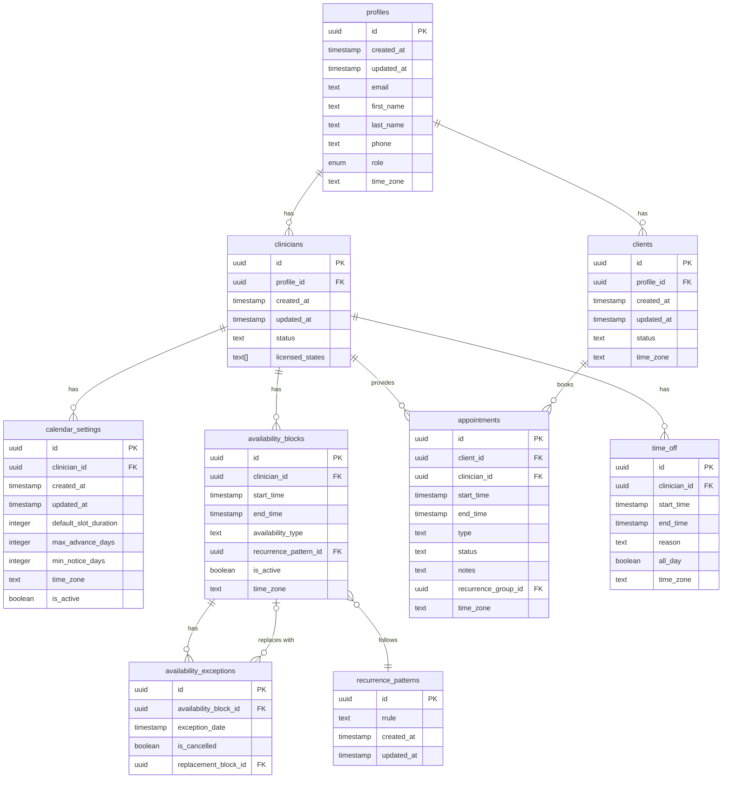
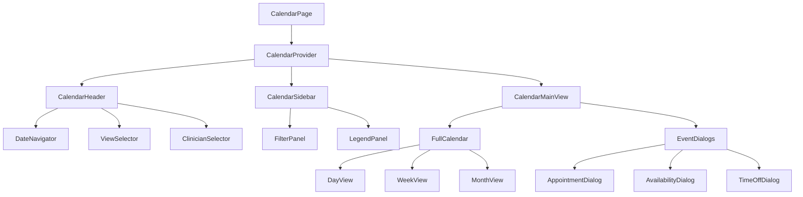
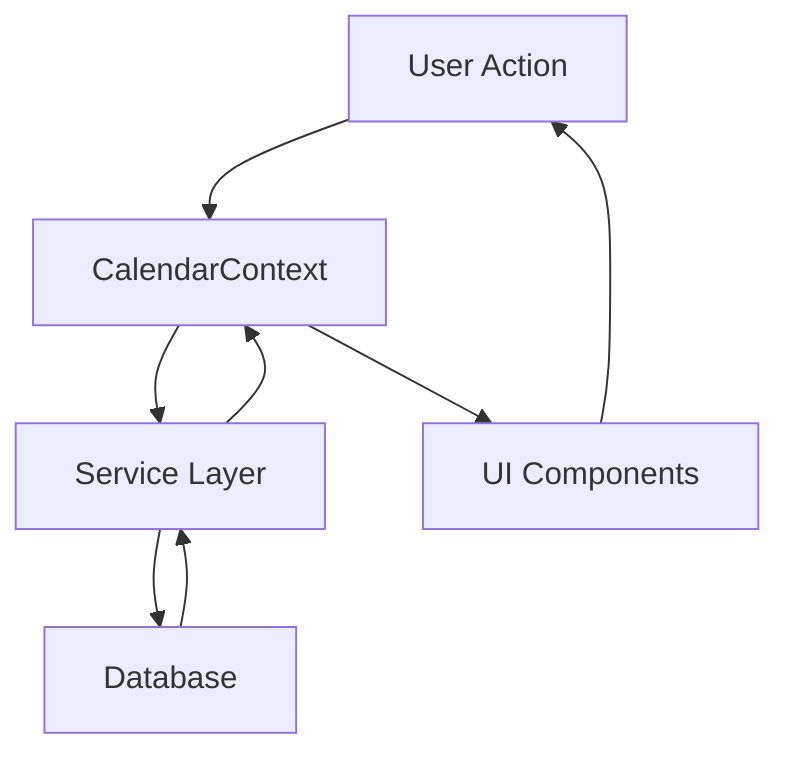

# Calendar System Documentation

## Table of Contents

1. [Summary of Changes](#summary-of-changes)
2. [Calendar System Architecture](#calendar-system-architecture)
3. [Best Practices Guide](#best-practices-guide)
4. [Testing Strategy](#testing-strategy)

## Summary of Changes

### High-level Overview of Issues Fixed

#### 1. Inconsistent Timezone Handling

The previous implementation had several issues with timezone handling:
- Inconsistent timezone formats (mix of abbreviations, IANA names, and offsets)
- Direct use of multiple date libraries (Date, Moment, Luxon) without standardization
- Timezone conversion happening at multiple layers, leading to bugs
- Lack of proper error handling for invalid timezones

**Solution**: Implemented a comprehensive `TimeZoneService` as the single source of truth for all timezone operations, with standardized formats and robust error handling.

#### 2. Database Schema Issues

The previous schema had several problems:
- Mixed event types in a single table, making queries complex
- Lack of proper foreign key constraints and data validation
- Inconsistent UUID handling
- No standardized approach for storing timezone information

**Solution**: Rebuilt the database schema with proper separation of concerns, constraints, and relationships. Created separate tables for different event types and implemented a unified view for querying.

#### 3. Permission Problems

The previous permission system had issues:
- Inconsistent permission checks across different components
- No row-level security in the database
- Unclear permission levels and rules

**Solution**: Implemented a comprehensive permission system with clear levels (none, read, write, admin) and row-level security policies in the database.

#### 4. Component Architecture

The previous component architecture had issues:
- Deep nesting leading to prop drilling
- Inconsistent state management
- Tightly coupled components

**Solution**: Restructured the component hierarchy to be more flat, with a clear separation of concerns and improved state management.

#### 5. State Management

The previous state management had issues:
- Scattered state across multiple components
- Lack of proper typing
- Inefficient rendering due to unnecessary re-renders

**Solution**: Centralized state management with a well-structured `CalendarContext`, proper typing, and optimized rendering.
### Approach to Fixes

#### Timezone Handling Migration

1. Created a comprehensive `TimeZoneService` with:
   - Core timezone conversion functions
   - Formatting utilities
   - Calendar-specific timezone operations
   - Robust error handling

2. Implemented a phased migration plan:
   - Phase 1: Core infrastructure (TimeZoneService, TimeZoneContext)
   - Phase 2: Component & hook migration
   - Phase 3: Service layer updates
   - Phase 4: Testing and validation
   - Phase 5: Clean-up and documentation

3. Added detection tools:
   - Deprecation warnings for legacy timezone functions
   - Audit script to detect non-compliant timezone usage

#### Database Schema Rebuild

1. Designed a new schema with:
   - Separate tables for availability, appointments, and time off
   - Clear relationships between entities
   - Proper constraints for data validation
   - Consistent UUID handling

2. Implemented the schema with:
   - Foreign key constraints
   - Check constraints for data validation
   - Indexes for performance optimization
   - Row-level security policies

3. Created a unified calendar view for easier querying

#### Service Layer Improvements

1. Implemented specialized services:
   - `AvailabilityService` for availability blocks
   - `AppointmentService` for appointments
   - `TimeOffService` for time off periods
   - `RecurrenceService` for recurring events

2. Created a facade pattern with `CalendarService` as the main entry point

3. Added proper error handling and validation throughout the service layer

#### Component Architecture Restructuring

1. Implemented a clear component hierarchy:
   - `CalendarPage` as the main container
   - `CalendarProvider` for state management
   - Specialized components for different parts of the UI

2. Reduced nesting and prop drilling through context usage

3. Improved component reusability and maintainability

### Design Decisions and Trade-offs

#### 1. UTC Storage vs. Timezone Storage

**Decision**: Store all dates in UTC in the database, with an additional timezone field for reference.

**Trade-offs**:
- **Pros**: Simplifies queries, ensures consistent sorting, avoids DST issues
- **Cons**: Requires conversion at display time, adds complexity for timezone-aware operations

#### 2. Luxon as the Standard Date Library

**Decision**: Use Luxon exclusively for all date/time operations.

**Trade-offs**:
- **Pros**: Consistent API, better timezone handling, immutable objects
- **Cons**: Learning curve for developers familiar with other libraries, potential migration effort

#### 3. Facade Pattern for Calendar Services

**Decision**: Implement a facade pattern with `CalendarService` as the main entry point.

**Trade-offs**:
- **Pros**: Simplifies client code, provides a unified API, encapsulates complexity
- **Cons**: Additional layer of abstraction, potential performance overhead

#### 4. Separate Tables for Different Event Types
## Calendar System Architecture

### Updated Architecture Diagram

#### Database Schema



#### Component Hierarchy



#### Service Layer Architecture

```mermaid
graph TD
    A[CalendarService] --> B[AvailabilityService]
    A --> C[AppointmentService]
    A --> D[TimeOffService]
    A --> E[RecurrenceService]
    
    B --> F[Supabase Client]
    C --> F
    D --> F
    E --> F
    
    G[TimeZoneService] --> B
    G --> C
    G --> D
    G --> E
    
    H[PermissionService] --> B
    H --> C
### Component Interactions

#### CalendarService Coordination

The `CalendarService` acts as a facade for all calendar operations:

1. **Event Retrieval**:
   ```typescript
   // CalendarService delegates to appropriate service based on event type
   static async getEvents(clinicianId, timeZone, startDate, endDate) {
     const [availability, appointments, timeOff] = await Promise.all([
       AvailabilityService.getAvailability(clinicianId, timeZone, startDate, endDate),
       AppointmentService.getAppointments(clinicianId, timeZone, startDate, endDate),
       TimeOffService.getTimeOff(clinicianId, timeZone, startDate, endDate)
     ]);
     
     return [...availability, ...appointments, ...timeOff];
   }
   ```

2. **Event Creation**:
   ```typescript
   // CalendarService delegates to appropriate service based on event type
   static async createEvent(event, timeZone) {
     switch (event.eventType) {
       case 'availability':
         return AvailabilityService.createAvailability(event, timeZone);
       case 'appointment':
         return AppointmentService.createAppointment(event, timeZone);
       case 'time_off':
         return TimeOffService.createTimeOff(event, timeZone);
       default:
         throw new Error(`Unknown event type: ${event.eventType}`);
     }
   }
   ```

#### TimeZoneService Usage

The `TimeZoneService` is used throughout the application:

1. **In Services**:
   ```typescript
   // Converting database times to user timezone
   const localTime = TimeZoneService.fromUTC(dbTime, userTimeZone);
   
   // Converting user input to UTC for storage
   const utcTime = TimeZoneService.toUTC(localTime);
   ```

2. **In Components**:
   ```typescript
   // Formatting dates for display
   const formattedDate = TimeZoneService.formatDateTime(date, 'full', userTimeZone);
   
   // Converting events to user timezone
   const localEvent = TimeZoneService.convertEventToUserTimeZone(event, userTimeZone);
   ```

#### Authentication Integration

Authentication is integrated with calendar operations:

1. **In CalendarContext**:
   ```typescript
   // CalendarProvider uses authentication state
   const { user, isLoading: isAuthLoading } = useAuth();
   
   // Load data when authentication is complete
   useEffect(() => {
     if (user && !isAuthLoading && state.selectedClinicianId) {
       refreshEvents();
     }
   }, [user, isAuthLoading, state.selectedClinicianId]);
   ```

2. **In Services**:
   ```typescript
   // Services use authentication for permission checks
   const canAccess = await PermissionService.canPerformAction(
     user.id,
     'appointment',
     appointmentId,
     'read'
   );
   ```

#### Permission Checks

Permission checks are performed at multiple levels:

1. **Database Level**:
   - Row-level security policies enforce permissions
   - Policies check user roles and relationships

2. **Service Layer**:
   ```typescript
   // Check permissions before performing actions
   if (!(await PermissionService.canPerformAction(userId, 'appointment', appointmentId, 'update'))) {
     throw new Error('Permission denied');
   }
   ```

3. **UI Level**:
   ```typescript
   // Disable or hide UI elements based on permissions
   const canEdit = usePermission('appointment', appointmentId, 'update');
   return (
     <Button disabled={!canEdit}>Edit</Button>
   );
   ```

### Data Flow

#### From Database to Service Layer

1. **Data Retrieval**:
   ```typescript
   // Query the database
   const { data, error } = await supabase
     .from('appointments')
     .select('*')
     .eq('clinician_id', clinicianId);
   
   // Handle errors
   if (error) {
     throw new Error(`Failed to fetch appointments: ${error.message}`);
   }
   
   // Transform data
   return data.map(appointment => ({
     id: appointment.id,
     title: appointment.type,
     start: TimeZoneService.fromUTC(appointment.start_time, timeZone),
     end: TimeZoneService.fromUTC(appointment.end_time, timeZone),
     // ...other fields
   }));
   ```

#### Through State Management

1. **State Updates**:
   ```typescript
   // Update state with new data
   setState(prev => ({
     ...prev,
     events: {
       ...prev.events,
       appointments: appointmentData
     },
     isLoading: {
       ...prev.isLoading,
       appointments: false
     }
   }));
   ```

#### To UI Components

1. **Rendering Data**:
   ```typescript
   // Use data from context
   const { events, isLoading } = useCalendar();
   
   // Render based on state
   if (isLoading.appointments) {
     return <LoadingSpinner />;
   }
   
   return (
     <FullCalendar
       events={[
         ...events.availability,
         ...events.appointments,
         ...events.timeOff
       ]}
     />
   );
   ```

#### Back to Database for Mutations

1. **Creating/Updating Data**:
   ```typescript
   // User action triggers context method
   const handleSave = async () => {
     const result = await createAppointment(formData);
     if (result) {
       closeDialog();
       refreshEvents();
     }
   };
   
   // Context method calls service
   const createAppointment = async (data) => {
     try {
       setState(prev => ({
         ...prev,
         isSubmitting: true
       }));
## Best Practices Guide

### Guidelines for Working with Dates and Times

#### 1. Always Use TimeZoneService

The `TimeZoneService` is the single source of truth for all timezone operations:

```typescript
// ❌ AVOID: Direct use of Date or Luxon
const now = new Date();
const luxonDate = DateTime.fromJSDate(now);

// ✅ CORRECT: Use TimeZoneService
const now = TimeZoneService.getCurrentDateTime(userTimeZone);
```

#### 2. Store All Dates in UTC in the Database

```typescript
// ❌ AVOID: Storing local times
await supabase.from('appointments').insert({
  start_time: localDateTime.toISO(),
  // ...other fields
});

// ✅ CORRECT: Convert to UTC before storing
const utcDateTime = TimeZoneService.toUTC(localDateTime).toISO();
await supabase.from('appointments').insert({
  start_time: utcDateTime,
  // ...other fields
});
```

#### 3. Convert Timezones Only at the Display Layer

```typescript
// ❌ AVOID: Converting at multiple layers
const utcTime = appointment.start_time;
const serverTime = DateTime.fromISO(utcTime).setZone('America/Chicago');
const userTime = serverTime.setZone(userTimeZone);

// ✅ CORRECT: Convert directly from UTC to user timezone
const userTime = TimeZoneService.fromUTC(appointment.start_time, userTimeZone);
```

#### 4. Use IANA Format for All Timezone Strings

```typescript
// ❌ AVOID: Non-standard timezone formats
const timezone = 'EST';
const timezone = '-05:00';

// ✅ CORRECT: Use IANA format
const timezone = 'America/New_York';
```

#### 5. Always Validate Timezone Inputs

```typescript
// ❌ AVOID: Using unvalidated timezone inputs
const dateTime = DateTime.fromISO(dateStr).setZone(inputTimeZone);

// ✅ CORRECT: Validate timezone inputs
const validTimeZone = TimeZoneService.ensureIANATimeZone(inputTimeZone);
const dateTime = DateTime.fromISO(dateStr).setZone(validTimeZone);
```

### Using TimeZoneService and DateTime Utilities

#### Creating DateTime Objects

```typescript
// From date and time strings
const dateTime = TimeZoneService.createDateTime('2025-05-01', '14:30', 'America/Chicago');

// From ISO string
const dateTime = TimeZoneService.parseWithZone('2025-05-01T14:30:00', 'America/Chicago');

// Current time in a specific timezone
const now = TimeZoneService.getCurrentDateTime('America/Chicago');
```

#### Converting Between Timezones

```typescript
// Convert between timezones
const newYorkTime = TimeZoneService.convertDateTime(
  chicagoTime,
  'America/Chicago',
  'America/New_York'
);

// From UTC to user timezone
const localTime = TimeZoneService.fromUTC(utcString, userTimeZone);

// To UTC for storage
const utcTime = TimeZoneService.toUTC(localTime);
```

#### Formatting for Display

```typescript
// Format with predefined formats
const fullDate = TimeZoneService.formatDateTime(date, 'DATE_FULL'); // May 1, 2025
const shortDate = TimeZoneService.formatDateTime(date, 'DATE_SHORT'); // 5/1/2025
const time12h = TimeZoneService.formatTime(time, 'TIME_12H'); // 2:30 PM
const time24h = TimeZoneService.formatTime(time, 'TIME_24H'); // 14:30
const fullDateTime = TimeZoneService.formatDateTime(date, 'DATETIME_FULL'); // May 1, 2025, 2:30 PM

// Format with custom format strings
const custom = TimeZoneService.formatDateTime(date, 'EEEE, MMMM d, yyyy'); // Thursday, May 1, 2025

// Format timezone for display
const tzDisplay = TimeZoneService.formatTimeZoneDisplay(userTimeZone); // America/Chicago (CDT -05:00)
```

#### Working with Calendar Events

```typescript
// Convert a calendar event to user timezone
const localEvent = TimeZoneService.convertEventToUserTimeZone(event, userTimeZone);

// Check if two dates are on the same day
const isSameDay = TimeZoneService.isSameDay(date1, date2);

// Add duration to a date
const tomorrow = TimeZoneService.addDuration(today, 1, 'days');
const oneHourLater = TimeZoneService.addDuration(now, 1, 'hours');
```

### Common Pitfalls to Avoid

#### 1. Mixing Timezone Handling Methods

```typescript
// ❌ AVOID: Mixing methods
const date = new Date();
const luxonDate = DateTime.fromJSDate(date);
const formatted = moment(luxonDate.toJSDate()).format('YYYY-MM-DD');

// ✅ CORRECT: Consistent use of TimeZoneService
const date = TimeZoneService.getCurrentDateTime(userTimeZone);
const formatted = TimeZoneService.formatDateTime(date, 'yyyy-MM-dd');
```

#### 2. Forgetting to Handle Invalid Inputs

```typescript
// ❌ AVOID: Not handling invalid inputs
const dateTime = DateTime.fromISO(userInput).setZone(userTimeZone);

// ✅ CORRECT: Proper error handling
try {
  const dateTime = TimeZoneService.parseWithZone(userInput, userTimeZone);
  // Use dateTime
} catch (error) {
  if (error instanceof TimeZoneError) {
    // Handle specific timezone errors
    console.error(`TimeZone error: ${error.message}, Code: ${error.code}`);
  } else {
    // Handle other errors
    console.error('An error occurred:', error);
  }
}
```

#### 3. Incorrect Timezone Conversion

```typescript
// ❌ AVOID: Manual timezone conversion
const offset = new Date().getTimezoneOffset();
const localTime = new Date(utcTime.getTime() - offset * 60000);

// ✅ CORRECT: Use TimeZoneService for conversion
const localTime = TimeZoneService.fromUTC(utcTime, userTimeZone);
```

#### 4. Not Handling DST Transitions

```typescript
// ❌ AVOID: Assuming fixed offset
const offset = -5 * 60 * 60 * 1000; // 5 hours in milliseconds
const localTime = new Date(utcTime.getTime() + offset);

// ✅ CORRECT: Let TimeZoneService handle DST
const localTime = TimeZoneService.fromUTC(utcTime, 'America/New_York');
```

#### 5. Inconsistent Date Storage

```typescript
// ❌ AVOID: Storing dates in different formats
await supabase.from('appointments').insert({
  start_time: '2025-05-01T14:30:00-05:00', // Local time with offset
  end_time: '2025-05-01T19:30:00Z', // UTC time
});

// ✅ CORRECT: Consistent UTC storage
await supabase.from('appointments').insert({
## Testing Strategy

### Test Coverage Overview

#### Unit Tests

1. **TimeZoneService Tests**:
   - Core timezone conversion functions
   - Formatting utilities
   - Error handling
   - Edge cases like DST transitions

2. **DateTime Utility Tests**:
   - Validation functions
   - Conversion functions
   - Comparison functions
   - Formatting functions

3. **Service Layer Tests**:
   - CalendarService
   - AvailabilityService
   - AppointmentService
   - TimeOffService
   - RecurrenceService

#### Integration Tests

1. **Calendar Component Tests**:
   - CalendarContext integration
   - Service layer integration
   - UI component interaction

2. **Database Integration Tests**:
   - Database schema validation
   - Query performance
   - Transaction handling

3. **API Integration Tests**:
   - API endpoint functionality
   - Error handling
   - Authentication integration

#### End-to-End Tests

1. **Critical User Flows**:
   - Creating and managing availability
   - Booking appointments
   - Managing time off
   - Viewing calendar in different timezones

### Running Tests

#### Commands for Running Tests

```bash
# Run all tests
npx jest

# Run specific test file
npx jest src/__tests__/unit/TimeZoneService.test.ts

# Run tests with verbose output
npx jest --verbose

# Run tests with coverage report
npx jest --coverage

# Run tests in watch mode
npx jest --watch
```

#### Test Environment Setup

1. **Jest Configuration**:
   ```javascript
   // jest.config.js
   module.exports = {
     preset: 'ts-jest',
     testEnvironment: 'jsdom',
     setupFilesAfterEnv: ['<rootDir>/src/setupTests.ts'],
     moduleNameMapper: {
       '^@/(.*)$': '<rootDir>/src/$1'
     }
   };
   ```

2. **Mock Setup**:
   ```typescript
   // src/setupTests.ts
   import '@testing-library/jest-dom';
   import { TimeZoneService } from '@/utils/timezone';
   
   // Mock TimeZoneService for consistent testing
   jest.mock('@/utils/timezone', () => ({
     TimeZoneService: {
       getCurrentDateTime: jest.fn().mockReturnValue(/* mock value */),
       // Other methods...
     }
   }));
   
   // Mock Supabase client
   jest.mock('@/integrations/supabase/client', () => ({
     supabase: {
       from: jest.fn().mockReturnValue({
         select: jest.fn().mockReturnThis(),
         insert: jest.fn().mockReturnThis(),
         update: jest.fn().mockReturnThis(),
         delete: jest.fn().mockReturnThis(),
         eq: jest.fn().mockReturnThis(),
         single: jest.fn().mockReturnThis(),
         then: jest.fn().mockImplementation(cb => cb({ data: [], error: null }))
       }
     }
   }));
   ```

#### Interpreting Test Results

1. **Test Output**:
   ```
   PASS src/__tests__/unit/TimeZoneService.test.ts
     TimeZoneService
       Backward Compatibility Methods
         ✓ validateTimeZone should call ensureIANATimeZone (5ms)
         ✓ convertTimeZone should call convertDateTime (1ms)
       Core Timezone Methods
         ✓ ensureIANATimeZone should validate and return a timezone (2ms)
         ✓ createDateTime should create a valid DateTime object (1ms)
         ✓ getCurrentDateTime should return current time in specified timezone (1ms)
         ✓ fromUTC should convert UTC string to local timezone (1ms)
       Formatting Methods
         ✓ formatDateTime should format a DateTime correctly (2ms)
         ✓ formatTimeZoneDisplay should create a user-friendly timezone string (1ms)
       Utility Methods
         ✓ isSameDay should correctly compare dates (1ms)
         ✓ addDuration should add time correctly (1ms)
         ✓ convertEventToUserTimeZone should convert calendar events (1ms)
   
   Test Suites: 1 passed, 1 total
   Tests:       11 passed, 11 total
   Snapshots:   0 total
   Time:        1.5s
   ```

2. **Coverage Report**:
   ```
   -----------------------------|---------|----------|---------|---------|-------------------
   File                         | % Stmts | % Branch | % Funcs | % Lines | Uncovered Line #s 
   -----------------------------|---------|----------|---------|---------|-------------------
   All files                    |   92.31 |    85.71 |   88.89 |   92.31 |                   
    utils/timezone              |   92.31 |    85.71 |   88.89 |   92.31 |                   
     TimeZoneService.ts         |   92.31 |    85.71 |   88.89 |   92.31 | 45-48             
   -----------------------------|---------|----------|---------|---------|-------------------
   ```

### Adding New Tests

#### Guidelines for Writing Timezone-Aware Tests

1. **Use Fixed Dates for Testing**:
   ```typescript
   // Use a fixed date for consistent testing
   const testDate = DateTime.fromISO('2025-05-01T12:00:00', { zone: 'UTC' });
   
   // Mock getCurrentDateTime to return the fixed date
   jest.spyOn(TimeZoneService, 'getCurrentDateTime').mockReturnValue(testDate);
   ```

2. **Test with Multiple Timezones**:
   ```typescript
   // Test with different timezones
   const timezones = ['UTC', 'America/New_York', 'Asia/Tokyo', 'Europe/London'];
   
   timezones.forEach(timezone => {
     it(`should work correctly with ${timezone}`, () => {
       const result = TimeZoneService.fromUTC('2025-05-01T12:00:00Z', timezone);
       expect(result.isValid).toBe(true);
       expect(result.zoneName).toBe(timezone);
     });
   });
   ```

3. **Mock TimeZoneContext**:
   ```typescript
   // Mock the TimeZoneContext hook
   jest.mock('@/context/TimeZoneContext', () => ({
     useTimeZone: () => ({
       userTimeZone: 'America/Chicago',
       isLoading: false,
       error: null,
       isAuthenticated: true,
       updateUserTimeZone: jest.fn()
     })
   }));
   ```

#### Testing Edge Cases

1. **DST Transitions**:
   ```typescript
   it('should handle DST transitions correctly', () => {
     // March 14, 2021, 1:30 AM - just before DST transition in America/New_York
     const beforeDST = DateTime.fromISO('2021-03-14T01:30:00', { zone: 'America/New_York' });
     
     // Add 1 hour to cross DST transition
     const afterDST = TimeZoneService.addDuration(beforeDST, 1, 'hours');
     
     // Should be 3:30 AM due to DST jump
     expect(afterDST.hour).toBe(3);
     expect(afterDST.minute).toBe(30);
   });
   ```

2. **Invalid Timezones**:
   ```typescript
   it('should handle invalid timezones gracefully', () => {
     // Should return default timezone (UTC) for invalid input
     const result = TimeZoneService.ensureIANATimeZone('Invalid/Timezone');
     expect(result).toBe('UTC');
     
     // Should throw specific error when strict validation is needed
     expect(() => {
       TimeZoneService.parseWithZone('2025-05-01T12:00:00', 'Invalid/Timezone');
     }).toThrow(TimeZoneError);
   });
   ```

3. **Date Parsing Edge Cases**:
   ```typescript
   it('should handle various date formats', () => {
     const formats = [
       '2025-05-01T12:00:00Z', // ISO with UTC
       '2025-05-01T12:00:00-05:00', // ISO with offset
       '2025-05-01 12:00:00', // SQL format
       '05/01/2025 12:00 PM', // US format
       '1 May 2025 12:00' // European format
     ];
     
     formats.forEach(format => {
       const result = safeToDateTime(format, 'UTC');
       expect(result).not.toBeNull();
       expect(result?.isValid).toBe(true);
     });
   });
   ```
  start_time: '2025-05-01T19:30:00Z', // UTC time
  end_time: '2025-05-01T20:30:00Z', // UTC time
  time_zone: 'America/Chicago' // Store reference timezone
});
```
       
       const result = await CalendarService.createEvent({
         ...data,
         eventType: 'appointment'
       }, userTimeZone);
       
       return result;
     } catch (error) {
       setError(error);
       return null;
     } finally {
       setState(prev => ({
         ...prev,
         isSubmitting: false
       }));
     }
   };
   ```
    H --> D
    H --> E
```

#### State Management Flow



**Decision**: Create separate tables for availability, appointments, and time off.

**Trade-offs**:
- **Pros**: Clearer schema, specialized constraints, simpler queries for specific event types
- **Cons**: More complex queries for unified views, potential data duplication